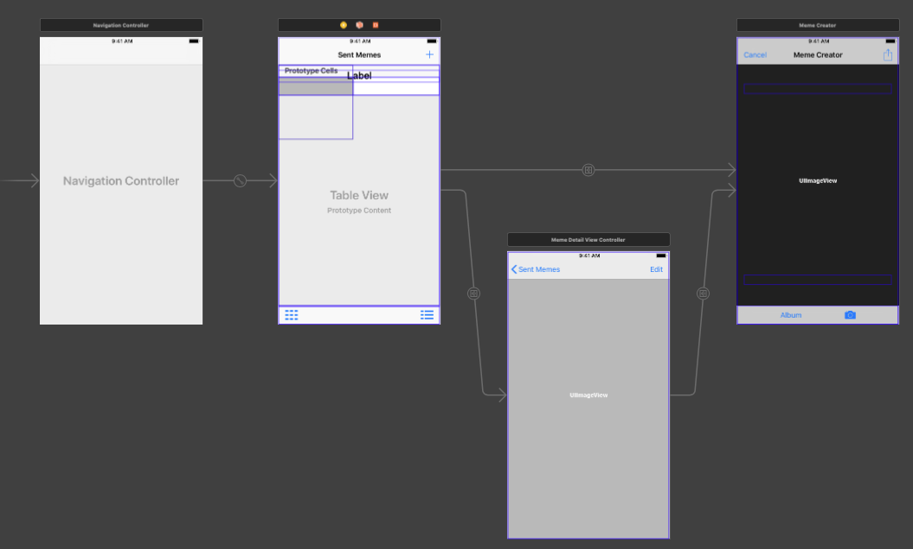

# MemeMe 2.0

## Description

IOS app allows for memes to be created and edited.

## Storyboard

Story board consists fo three views (Not including the navigational controller).

|       ViewControllersName.swift       | main.Storyboard | readme reference |
|----------------------------------------|----------------|--------------|
|      SentMemesViewController.swift     |     Sent Memes |  Sent View                   |
|      MemeDetailViewController.swift    |     Memes Details View Controller         |    Details View         |
|      MemeEditorViewController.swift    |     Meme Creator         |       Editor View           |



## Layout

### Sent Memes View

 Sent View is the root view consisting of a tool and navigational bar. The tool bar allowing memes to be viewed as a collection or table. By altering the alpha between the collections and table view, both can exist on the same view controller.

```javascript

 // MARK: - Jump between table and collections view
 // alpha factors used to hide and show views
 @IBAction func viewChanger(_ sender: UIButton) {
     if sender.tag == 1{
         tableview.alpha = 1
         collectionview.alpha = 0
     }else{
         tableview.alpha = 0
         collectionview.alpha = 1
     }

 }
 ```

 Both views contain cells that are created by the length of memes array. Cells adopt a class cell view controller (TableViewCell, CollectionViewCell) linking to UIimage hosting the meme. Cells are reused when scrolling.

```javascript
// make a cell for each meme struct in appDelegate array
func collectionView(_ collectionView: UICollectionView, cellForItemAt indexPath: IndexPath) -> UICollectionViewCell{
    // get a reference to our storyboard cell
    let cell = collectionView.dequeueReusableCell(withReuseIdentifier: reuseIdentifier, for: indexPath as IndexPath) as! CollectionViewCell

    // Use the outlet in our custom class to get a reference to the UIImage in the cell
    cell.myLabel.image = self.appDelegate.memes[indexPath.item].memedImage
    return cell
}
```

  A single bar button was placed at the top right allowing for a new meme to be created. Text will appear in a label below the navigational bar if no memes have been created.

### Meme Details View

This view is presented when a user selects a meme from sent Memes view. A full screen image of the meme is displayed and a navigational controller allows the user to go back to view or edit the current meme.

### Meme Editor View

This view is Meme1.0 for more info about this view check out the previous repro branch.

----

## Segues

Between the views three segues exist for the presentation of views in a particular way.  

A key feature to handle is what meme was click and needs to be presented on the Meme Details View. Comes down to indexing the memes array within the appdelegate. This array is share on all of the viewControllers. When a table row or collection cell is selected an integer is produced and is used to index the meme array.

### Sent Memes View

When sent table or collections view is populated then the edit segue can be triggered presenting the details View. Otherwise the only option is to create a meme, a button will execute the segue sending the user to the Editor View.

### Meme Details View

  Only two options exist, go back to the root view or edit the meme.

### Meme Editor View

A single option is available that causes the user to return to the sent view (root view). This can be done by having the user sending/saving their meme or canceling the meme.
