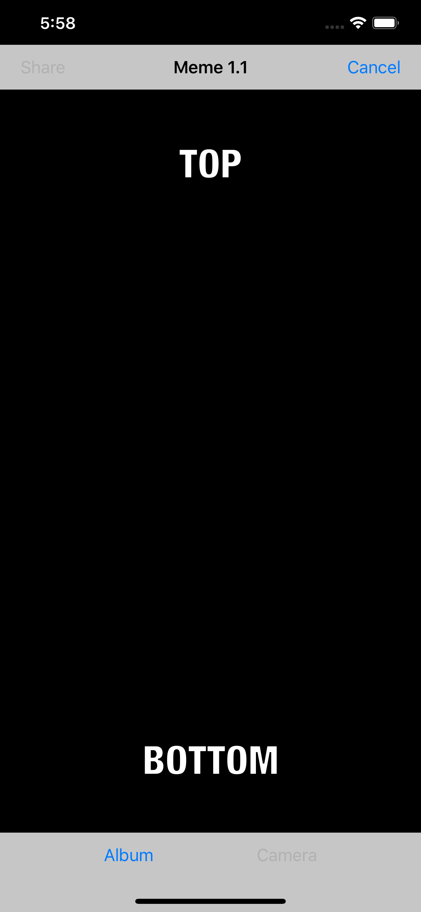
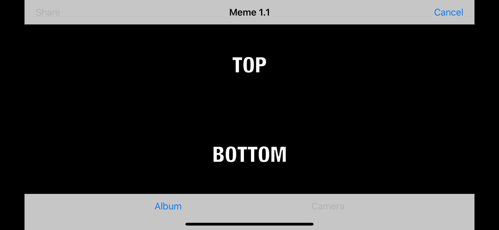

#  Meme1.1 : Meme Creator

Description: A IOS app that allows for a meme to be created through the camera or from the photo library.
---
## Meme Editor / General Code

### toolbar button

Tool bar consist of two UIbarbuttons. Left button allows the user to select from photo library labeled "Album". Right button labeled "Camera" allows user to use there camera to capture a image. Also viewDidLoad function checks to make sure a camera exist on the device.  One of two button will be picked for a image to be turned into a meme. 

### navigation-bar buttons

Navigation bar also has two UIbarbuttons, one for share/saving the meme and other for canceling the meme. Share/save button is labeled "Share", also disabled until a Image has been selected preventing sharing/saving of a black screen. Cancel button will revert to the default scene.

### textfields

Two textfield exist in the view allowing for text to be written on top of the UIImage. The font is white text with a black outline creating readable text despite what the image is. One textfield is placed around 25 precent from the top of the view, other being 75 precent. The top text field has the default text of "TOP", bottom text field is "BOTTOM". When a user first clicks on either text field the default text within will disappear. This is done by a function (textFieldDidBeginEditing 162,167) that checks for the default text being in the textfields. This could be a problem if the user trys to create a meme with text that match the default text. 

'

### delegates and notifications

#### Delegates:

<u>UIImage (imagePicker) </u>: Allow for a UIImageObject to be passed to either the library view or camera view. 
 
 <u>TextFields ( topTextField, bottomTextField)</u>: Allow for controlling and maintain text and font within the Textfields. 
 
<u>BarButton (shareButton) </u>: Moves the meme to a build in navigational controller which will allow for saving or sharing of the meme.

#### Notifications:

A notificaiton is used to prevent obstruction of the bottom textfield when the keyboard is up. Still unsure on how a notification works (alot of moving parts), but it executes getKeyboardHeight which returns a float to identify how high to move the view on the Y axis. 
